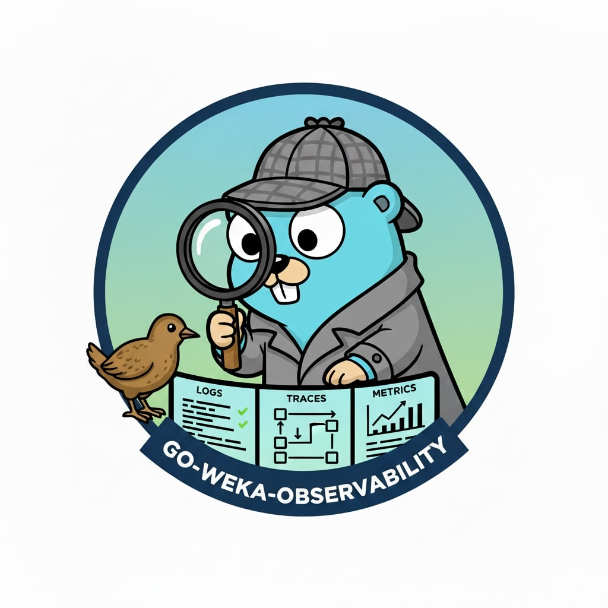

# go-weka-observability

Observability toolkit for Go applications: structured logging with automatic rotation + OpenTelemetry instrumentation.
**📖 [Complete Documentation](docs/logger-configuration-api.md)**


## Installation

```bash
go get github.com/weka/go-weka-observability
```

## 📦 Upgrading from Older Versions?

If you're seeing deprecation warnings for `GetLoggerForContext`, `SetupOTelSDK`, `GetLogSpan`, or `NewZeroLogger`, you're using the old API.

**Quick migration examples:**

### Logger Initialization
```go
// OLD (deprecated)
ctx, logger := instrumentation.GetLoggerForContext(ctx, nil, name)
shutdownFn, err := instrumentation.SetupOTelSDK(ctx, name, version, logger)

// NEW (recommended - SetupOTelSDK first, then ContextWithLogr)
logr := logger.CreateLogger(logger.WithInfoLevel())
shutdownFn, err := instrumentation.SetupOTelSDKWithOptions(ctx, name, version, logr)
ctx = logger.ContextWithLogr(ctx, logr)  // Must be before CreateSpan, order with SetupOTelSDK doesn't matter
```

### Span Creation (SpanLogger API)
```go
// OLD (deprecated)
ctx, logger, end := instrumentation.GetLogSpan(ctx, "operation")
defer end()

// NEW - Choose based on your use case:

// 1. Creating owned spans with key-value pairs (most common)
ctx, logger := instrumentation.CreateSpan(ctx, "operation", "key", "value")
defer logger.End()

// 2. Type-safe span creation with OpenTelemetry options (RECOMMENDED: use WithValues for attributes)
ctx, logger := instrumentation.CreateSpanWithOptions(ctx, "database-query",
    trace.WithSpanKind(trace.SpanKindClient),
)
// Add attributes to BOTH logger and span
ctx, logger = logger.WithValues(
    "db.system", "postgresql",
    "db.statement", "SELECT * FROM users",
)
defer logger.End()  // Recommended: defer after enrichment

// 3. Convenience functions for common span kinds (RECOMMENDED: use WithValues for attributes)
ctx, logger := instrumentation.CreateClientSpan(ctx, "http-request")
// Add attributes to BOTH logger and span
ctx, logger = logger.WithValues("http.url", "https://api.example.com")
defer logger.End()  // Recommended: defer after enrichment

// 4. Logging under current span (helper functions)
view := instrumentation.CurrentSpanLogger(ctx)
view.Info("Helper logging")
// No End() call - compile-time safety!

// 5. Independent traces (background jobs)
ctx, logger := instrumentation.CreateRootSpan(ctx, "background-job", "job_id", "123")
defer logger.End()
```

📖 **[Complete Migration Guide](docs/logger-initialization-migration.md)** - Covers all migration scenarios including:
- `GetLoggerForContext` → `CreateLogger` + `ContextWithLogr` migration
- `GetLogSpan` → `CreateSpan`/`CurrentSpanLogger`/`CreateRootSpan` migration (see [examples](examples/))
- `zerologr.New()` pattern migration
- Custom formatting and file logging
- `LogrFromContextOrDefault` for flexible logger retrieval
- Complete API reference table

## Quick Start

**Note:** All logger creation methods automatically respect environment variables (LOG_MODE, LOG_LEVEL, LOG_FORMAT, etc.) following the 12-factor app pattern. Environment variables always override code defaults.

### Console Logger (Default)

```go
import "github.com/weka/go-weka-observability/logger"

// Creates default logger: console sink, JSON format, info level
// Override via env: LOG_MODE=file LOG_LEVEL=0 LOG_FORMAT=raw
logr := logger.CreateLogger()
logr.Info("Application started")
```

### File Logger with Rotation

```go
// File logger with automatic rotation (overrideable via LOG_* env vars)
logr := logger.CreateLogger(
    logger.WithFileSink("/var/log", "app.log"),
    logger.WithRotation(100, 5, 28), // 100MB, 5 files, 28 days
)
// Override via env: LOG_MODE=console to switch to stderr
```

### Explicit Configuration

```go
// Set explicit defaults (still overrideable via LOG_* env vars)
logr := logger.CreateLogger(
    logger.WithConsoleSink(),
    logger.WithInfoLevel(),
    logger.WithJSONFormat(),
)
ctx = logger.ContextWithLogr(ctx, logr)

// Use logger
logger := logger.MustLogrFromContext(ctx)
logger.Info("Operation started")
```

### With OpenTelemetry

```go
import (
    "github.com/weka/go-weka-observability/instrumentation"
    "github.com/weka/go-weka-observability/logger"
)

// Initialize logger (overrideable via LOG_* env vars)
logr := logger.CreateLogger(
    logger.WithConsoleSink(),
    logger.WithInfoLevel(),
)

// Setup OpenTelemetry (OTEL_EXPORTER_OTLP_ENDPOINT env var can override)
shutdownFn, err := instrumentation.SetupOTelSDKWithOptions(
    ctx, "my-service", "v1.0.0", logr,
    instrumentation.WithDefaultOTLPEndpoint("http://otel-collector:4317"),
)
if err != nil {
    panic(err)
}
defer shutdownFn(ctx)

// Store logger in context (can also be done before SetupOTelSDK)
ctx = logger.ContextWithLogr(ctx, logr)

// Create traced operations with automatic logging
// Multiple API functions for different span ownership patterns:

// 1. CreateSpan - Create child span with key-value pairs (simple, recommended for most cases)
ctx, spanLogger := instrumentation.CreateSpan(ctx, "operation-name", "key", "value")
defer spanLogger.End() // Required!

spanLogger.Info("Operation in progress")

// 2. CreateSpanWithOptions - Type-safe span creation (RECOMMENDED: use WithValues for attributes)
import "go.opentelemetry.io/otel/trace"

ctx, dbLogger := instrumentation.CreateSpanWithOptions(ctx, "database-query",
    trace.WithSpanKind(trace.SpanKindClient),
)
defer dbLogger.End() // Required!

// Add attributes to BOTH logger and span
ctx, dbLogger = dbLogger.WithValues(
    "db.system", "postgresql",
    "db.name", "users_db",
)

dbLogger.Info("Executing database query")

// 3. Convenience functions for common span kinds (RECOMMENDED: use WithValues for attributes)
ctx, httpLogger := instrumentation.CreateClientSpan(ctx, "http-api-call")
defer httpLogger.End()

// Add attributes to BOTH logger and span
ctx, httpLogger = httpLogger.WithValues(
    "http.method", "GET",
    "http.url", "https://api.example.com/users",
)

httpLogger.Info("Making HTTP request")

// 4. CurrentSpanLogger - Borrow current span (no End call, no new span)
view := instrumentation.CurrentSpanLogger(ctx)
view.Info("Helper function logging") // Cannot call view.End() - compile error!

// 5. CreateRootSpan - Start independent trace (new trace ID)
ctx, rootLogger := instrumentation.CreateRootSpan(ctx, "background-job", "job_id", "123")
defer rootLogger.End() // Required!

rootLogger.Info("Background job with independent trace")

// 6. Advanced: Direct tracer access (for OTel library integration)
tracer := instrumentation.GetTracer(ctx)
ctx, span := tracer.Start(ctx, "custom-operation")
defer span.End()
// Note: No SpanLogger integration - manual span management
```

## Documentation

### Logger
- **[Logger Configuration API](docs/logger-configuration-api.md)** - Complete configuration guide, use cases, environment variables, best practices, troubleshooting
- **[Migration Guide](docs/logger-initialization-migration.md)** - Upgrade from deprecated `GetLoggerForContext` API

### Instrumentation (OpenTelemetry)
- **[Instrumentation Configuration API](docs/instrumentation-configuration-api.md)** - Complete tracing configuration guide, usage patterns, environment variables, best practices
- **[SpanLogger API](docs/spanlogger-api.md)** - Complete guide to type-safe span creation with OpenTelemetry options, convenience functions, and SpanLogger integration
- **[Trace Management](docs/trace-management.md)** - Smart tracer resolution system, provider detection, context-based injection, and testing strategies
- **[Versioning Strategy](docs/versioning.md)** - Library versioning, OpenTelemetry instrumentation scope, CI/CD release process

### Examples
- **[Examples](examples/)** - Runnable code examples demonstrating common patterns

## Environment Variables

**Important:** All logger creation methods (`CreateLogger()`, `CreateLoggerFrom()`) automatically apply environment variable overrides. You can set application defaults in code, and users can override them via environment variables at runtime.

### Logger Configuration

All environment variables are optional and override code defaults:

| Variable | Default | Description |
|----------|---------|-------------|
| `LOG_MODE` | `console` | Output mode: `console` or `file` |
| `LOG_DIR` | `/var/log` | Log directory (file mode only) |
| `LOG_FILE_NAME` | - | Log file name (file mode only) |
| `LOG_MAX_SIZE_MB` | `100` | Max file size before rotation (MB) |
| `LOG_MAX_FILES` | `5` | Max number of backup files |
| `LOG_MAX_AGE_DAYS` | `28` | Max age for log retention (days) |
| `LOG_LEVEL` | `1` (info) | Minimum log level (-1=trace, 0=debug, 1=info, 2=warn, 3=error) |
| `LOG_FORMAT` | `json` | Output format: `json`, `raw`, `plain` |
| `LOG_TIME_ONLY` | `false` | Use time-only format instead of full timestamp |
| `LOG_CALLER_DIR_LVL` | `-1` | Number of directory levels in caller field (-1=disabled) |

### Instrumentation (OpenTelemetry) Configuration

| Variable | Default | Description |
|----------|---------|-------------|
| `OTEL_EXPORTER_OTLP_ENDPOINT` | - | OTLP collector endpoint (e.g., `http://localhost:4317`) |

**Note:** `WithDefaultOTLPEndpoint()` sets a code default that `OTEL_EXPORTER_OTLP_ENDPOINT` can override.

See [Logger Configuration Guide](docs/logger-configuration-api.md#environment-configuration) and [Instrumentation Configuration Guide](docs/instrumentation-configuration-api.md#environment-configuration) for complete details.

## Features

- **Structured Logging**: Zero-allocation JSON logging via [zerolog](https://github.com/rs/zerolog)
- **Automatic Rotation**: File rotation with [lumberjack](https://github.com/natefinch/lumberjack)
- **Environment-Aware**: 12-factor app configuration via environment variables
- **Context Management**: Logger propagation through context
- **Flexible Configuration**: Functional options + struct-based config
- **OpenTelemetry Integration**: Automatic span creation with logger injection
- **Multi-Level Files**: Separate files for info and error logs
