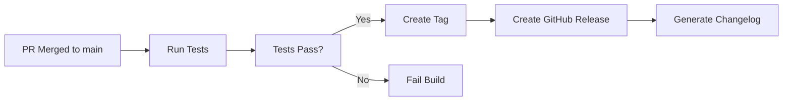

# Versioning Strategy

This document explains how versioning works in the `go-weka-observability` library, covering both Go module versioning and OpenTelemetry instrumentation scope versioning.

## Overview

The `go-weka-observability` library uses a **zero-configuration automatic versioning approach** that leverages Go's built-in module system. No manual version updates or CI/CD injection is required.

## Version Information

### Library Version and Name (`internal/version`)

The library provides functions that automatically determine both the library version and module path:

```go
import "github.com/weka/go-weka-observability/internal/version"

// Get library version (without 'v' prefix)
libVersion := version.GetInstrumentationVersion()
// Returns: "1.2.3" (from tagged releases like v1.2.3 - 'v' prefix stripped)
// Returns: "0.0.0-20240116123456-abcdef123456" (from main branch pseudo-versions)
// Returns: "0.0.0-dev" (from local development builds)

// Get library module path (instrumentation name)
libName := version.GetInstrumentationName()
// Returns: "github.com/weka/go-weka-observability" (from module info)
```

### How Version and Name Resolution Works

Both version and module path are determined using Go's `debug.ReadBuildInfo()` API, which reads module metadata embedded at build time:

**Version Resolution** (`GetInstrumentationVersion()`):
1. **Tagged Releases**: When users run `go get github.com/weka/go-weka-observability@v1.2.3`, the tag's `v1.2.3` is embedded and the function returns `1.2.3` (with `v` prefix stripped)
2. **Latest Version**: `go get github.com/weka/go-weka-observability@latest` embeds the most recent tag (e.g., `v1.2.3` → returns `1.2.3`)
3. **Main Branch**: Direct dependency on `main` branch gets a pseudo-version with timestamp and commit hash (e.g., `v0.0.0-20240116123456-abc123` → returns `0.0.0-20240116123456-abc123`)
4. **Local Development**: Local builds without module metadata return `0.0.0-dev`

**Note**: The function always strips the `v` prefix from Git tags for consistency with semantic versioning conventions.

**Name Resolution** (`GetInstrumentationName()`):
1. **Module Path**: Automatically extracted from `info.Main.Path` in build info
2. **Always Available**: Module path is present in all build scenarios (installed, local, forked)
3. **Fork-Friendly**: If library is forked, the fork's module path is used automatically

### Version Sources

| Source | Returned Version (no `v` prefix) | How User Gets It |
|--------|----------------------------------|------------------|
| Tagged release | `1.2.3` | `go get github.com/weka/go-weka-observability@v1.2.3` |
| Latest release | `1.2.3` | `go get github.com/weka/go-weka-observability@latest` |
| Main branch | `0.0.0-20240116123456-abc123` | `go get github.com/weka/go-weka-observability@main` |
| Local development | `0.0.0-dev` | Local `go build` without module info |

## OpenTelemetry Instrumentation Scope

### What is Instrumentation Scope?

OpenTelemetry distinguishes between:
- **Resource attributes**: Identify the **service being monitored** (user's application)
- **Instrumentation scope**: Identifies the **library doing the instrumentation** (go-weka-observability)

### How It's Implemented

The library automatically sets its instrumentation scope when creating tracers, with **both name and version extracted from Go module information**:

```go
// In instrumentation/otel.go
Tracer = otel.Tracer(
    version.GetInstrumentationName(),                               // Library name (from module path)
    trace.WithInstrumentationVersion(version.GetInstrumentationVersion()), // Library version
)
```

Both the instrumentation name and version are automatically determined from Go's `debug.ReadBuildInfo()` - no hardcoded strings!

### User's Perspective

When users set up observability, they provide **their application's** name and version:

```go
import "github.com/weka/go-weka-observability/instrumentation"

// User's application setup
shutdown, err := instrumentation.SetupOTelSDKWithOptions(
    ctx,
    "my-weka-app",      // User's service name (goes to resource attributes)
    "2.5.0",            // User's app version (goes to resource attributes)
    logger,
)
```

### What Appears in Traces

Traces will show **both** the user's application information and the library's instrumentation scope:

```
Resource Attributes (the service being monitored):
  service.name: "my-weka-app"
  service.version: "2.5.0"

Instrumentation Scope (the code creating traces):
  # In OTLP format (native):
  InstrumentationScope.name: "github.com/weka/go-weka-observability"
  InstrumentationScope.version: "1.2.3"

  # When exported to non-OTLP backends (as span attributes):
  otel.scope.name: "github.com/weka/go-weka-observability"
  otel.scope.version: "1.2.3"

  # Deprecated (for backward compatibility):
  otel.library.name: "github.com/weka/go-weka-observability"
  otel.library.version: "1.2.3"
```

### Benefits

1. **Debugging**: Identify which library version created specific traces
2. **Filtering**: Query traces by instrumentation scope version (`otel.scope.version` or `scope:version`)
3. **Troubleshooting**: Correlate trace issues with library releases
4. **Version Tracking**: See which library versions are deployed across services

### Example Queries

Different observability backends use different query syntaxes for instrumentation scope:

#### **Grafana Tempo (TraceQL)**

Uses intrinsics for querying instrumentation scope:

```traceql
# Find traces created by this library
{ scope:name = "github.com/weka/go-weka-observability" }

# Find traces from old library versions
{ scope:name = "github.com/weka/go-weka-observability" && scope:version < "2.0.0" }

# Find traces from specific library version
{ scope:version = "1.2.3" }

# Pattern matching on library name
{ scope:name =~ "github.com/weka/.*" }
```

#### **Jaeger, Prometheus, and Other Backends**

Use span attributes (when exported to non-OTLP formats):

```promql
# Current standard attributes
otel.scope.name = "github.com/weka/go-weka-observability"
otel.scope.version = "1.2.3"

# Find old library versions
otel.scope.name = "github.com/weka/go-weka-observability" AND
otel.scope.version < "2.0.0"
```

#### **Backward Compatibility (Deprecated)**

Some systems may still use the deprecated attributes:

```promql
# Deprecated (but may still work in some backends)
otel.library.name = "github.com/weka/go-weka-observability"
otel.library.version = "1.2.3"
```

## CI/CD Release Process

### Automated Tagging and Releases

The library uses GitHub Actions to automate version tagging and release creation:

**Workflow**: `.github/workflows/tag-release.yaml`

### How It Works

1. **Developer merges PR to `main` branch**
2. **Tests run automatically**: Linter, unit tests, build verification
3. **Semantic versioning**: Tag is created based on commit message
4. **GitHub release**: Automatic release with changelog

### Commit Message Conventions

The workflow uses semantic versioning conventions:

```bash
# Patch bump (1.0.0 → 1.0.1)
git commit -m "fix: correct version parsing logic"

# Minor bump (1.0.0 → 1.1.0)
git commit -m "feat: add new observability metric"

# Major bump (1.0.0 → 2.0.0)
git commit -m "feat!: breaking API change"
# OR
git commit -m "feat: new API

BREAKING CHANGE: removed old function"

# Skip versioning
git commit -m "docs: update README"
```

### Release Workflow Steps



1. **Test Job**:
   - Checkout code
   - Setup Go (version from `go.mod`)
   - Install dependencies
   - Run golangci-lint
   - Run all tests with race detection
   - Verify build succeeds
   - Test version function specifically

2. **Tag Job** (only after tests pass):
   - Create semantic version tag (e.g., `v1.2.3`)
   - Push tag to repository

3. **Release Job** (only if tag created):
   - Create GitHub release
   - Generate release notes automatically
   - Include usage instructions

### Manual Release

You can also trigger a release manually:

1. Go to **Actions** → **Tag and Release** in GitHub
2. Click **Run workflow**
3. Select `main` branch
4. Click **Run workflow**

### Version Visibility

Once a release is created:

```bash
# Users can install specific versions
go get github.com/weka/go-weka-observability@v1.2.3

# Or get the latest release
go get github.com/weka/go-weka-observability@latest
```

The library will automatically report its version via `GetInstrumentationVersion()` and in OpenTelemetry instrumentation scope.

## Version Implementation Details

### Code Location

```
go-weka-observability/
├── internal/version/
│   ├── version.go          # GetInstrumentationVersion() implementation
│   └── version_test.go     # Version resolution tests
└── instrumentation/
    └── otel.go             # Tracer creation with instrumentation scope
```

### Key Functions

**`internal/version/version.go`**:
```go
// GetInstrumentationVersion returns the library version using Go's module system
func GetInstrumentationVersion() string {
    if info, ok := debug.ReadBuildInfo(); ok {
        version := info.Main.Version
        // Process version string (strip "v" prefix, handle special cases)
        return processedVersion
    }
    return "0.0.0-dev"
}

// GetInstrumentationName returns the library module path using Go's module system
func GetInstrumentationName() string {
    if info, ok := debug.ReadBuildInfo(); ok {
        if info.Main.Path != "" {
            return info.Main.Path  // e.g., "github.com/weka/go-weka-observability"
        }
    }
    return "github.com/weka/go-weka-observability"  // Fallback
}
```

**`instrumentation/otel.go`**:
```go
// Create tracer with library instrumentation scope (both name and version automatic)
Tracer = otel.Tracer(
    version.GetInstrumentationName(),                               // Module path from build info
    trace.WithInstrumentationVersion(version.GetInstrumentationVersion()),  // Version from build info
)
```

## Best Practices

### For Library Maintainers

1. **Use semantic commit messages**: Follow conventional commits for proper versioning
2. **Let CI handle tagging**: Don't manually create version tags
3. **Test before merging**: The workflow ensures tests pass before tagging
4. **Review generated releases**: Check GitHub releases for accurate changelogs

### For Library Users

1. **Pin to specific versions**: Use `@v1.2.3` in production for stability
2. **Update regularly**: Check GitHub releases for new features and fixes
3. **Report issues with version info**: Include library version in bug reports
4. **Use `@latest` for development**: Get the newest features automatically

### Troubleshooting

**Q: Why does `GetInstrumentationVersion()` return `"0.0.0-dev"`?**

A: This happens in local development builds. It's normal and expected. When users install via `go get`, they'll get the proper version.

**Q: How do I find the library version in production?**

A: Check your observability backend for the instrumentation scope attributes in traces:

- **OTLP backends**: Look for `InstrumentationScope.version`
- **Non-OTLP backends**: Look for `otel.scope.version` (or deprecated `otel.library.version`)
- **Tempo/TraceQL**: Query using `scope:version` intrinsic

Or query the version programmatically:

```go
import "github.com/weka/go-weka-observability/internal/version"

log.Printf("Using go-weka-observability version: %s", version.GetInstrumentationVersion())
log.Printf("Module path: %s", version.GetInstrumentationName())
```

**Q: Can I manually set the version or module path?**

A: No, and you shouldn't need to. The Go module system automatically embeds both the module path and version. Manual injection would break this automatic mechanism and provide no benefits.

**Q: What if I need to override the version for testing?**

A: Use Go's build tags or ldflags for test builds, but this is rarely necessary. The default mechanism works for 99% of use cases.

## Related Documentation

- [OpenTelemetry Go Instrumentation](https://opentelemetry.io/docs/languages/go/libraries/)
- [Go Modules Reference](https://go.dev/ref/mod)
- [Semantic Versioning](https://semver.org/)
- [Conventional Commits](https://www.conventionalcommits.org/)

## Summary

The `go-weka-observability` library provides **automatic, zero-configuration versioning and identification** that:

- ✅ Uses Go's built-in module system for both version and module path
- ✅ Requires no manual version updates or hardcoded strings
- ✅ Automatically appears in OpenTelemetry traces with proper instrumentation scope
- ✅ Is managed by CI/CD workflows with semantic versioning
- ✅ Follows OpenTelemetry best practices for instrumentation libraries
- ✅ Provides clear version visibility for debugging and troubleshooting
- ✅ Fork-friendly: automatically adapts to forked module paths

This approach eliminates version management overhead while providing comprehensive version tracking and library identification for observability and debugging purposes.
